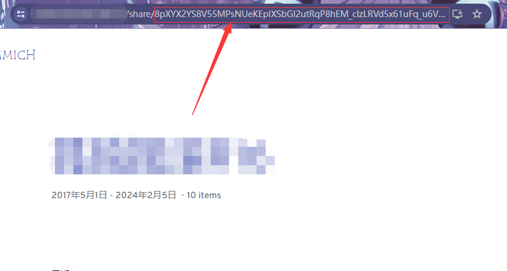

# picgo-plugin-immich

[PicGo](https://github.com/PicGo/PicGo-Core) plugin for uploading to [immich]().
 

 

## Install

- for GUI: search `immich` and install
- for Core: run `picgo add immich`
- for Typora: See [here](#for-typora)

 

## Configuration

For Core user, you can run `picgo set uploader immich` to enter interactive configuration.

For GUI user, you can configure in `Picbeds Settings`.

### `url`

- `Required`
- Example: `https://myimmich.com`

immich web URL, including the protocol.

### `token`

- `Required`
- Example: `xxxxxxxxxxxxx`  

immich API token.  
  
You can generate an API Token from the settings.  

### `albumId`

- Default: `unsorted`
- Example: `mTmo_j9SVEie3ETcCMY3YruI`  

Album ID, you can only use regular `share Album`, **not** `Album`.  
  
After entering the album, you can find the album ID in the URL.  

 

## For Typora

The internally packaged PicGo-Core in Typora uses Node.js `v12.13.0` and PicGo-Core `v1.4.7`. This version is outdated and cannot be compatible with the new APIs required by this tool.

**Please download the latest version of [PicGo-Core](https://github.com/PicGo/PicGo-Core) on your own and use a `custom command` in Typora to specify the use of the latest version of PicGo-Core.**

 

## LICENSE

MIT
